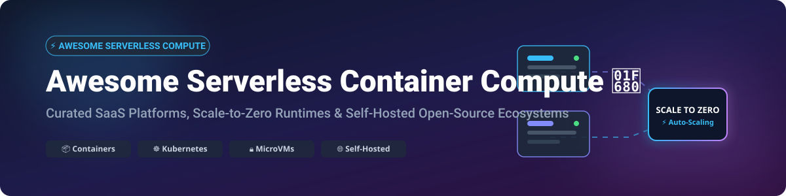

# Awesome Serverless Container Compute 🚀

  

  
  
  
  
  

---

## 📌 Top Serverless Container Compute Ecosystem

**Curated List of SaaS Platforms, Scale-to-Zero Runtimes & Open-Source Projects** 💡  
*Focused on Containerized Serverless, MicroVM Isolation, Kubernetes-Native Frameworks & Self-Hosted PaaS Solutions.*

**Last updated: October 2026** 📅

---

### 🔍 Overview & SEO Highlights
This curated repository tracks top **commercial serverless container platforms (SaaS)** and high-impact **open-source GitHub projects** that enable running microservices and containerized workloads without managing underlying infrastructure or virtual machines. Key features of this ecosystem include **scale-to-zero when idle**, **automatic request-driven scaling**, **microVM multi-tenant isolation**, and **event-driven autoscaling**. These platforms effectively bridge the complexity gap between bare Kubernetes clusters and classic Function-as-a-Service (FaaS) paradigms.

---

## 📑 Table of Contents
- [🌐 SaaS / Managed Hosted Platforms](#-saas--managed-hosted-platforms)
- [📦 Open-Source GitHub Projects](#-open-source-github-projects)
  - [⚡ Kubernetes-Native Serverless & FaaS](#-kubernetes-native-serverless--faas)
  - [🔒 Container Isolation & MicroVM Runtimes](#-container-isolation--microvm-runtimes)
  - [🚀 Self-Hosted PaaS & Deployment Platforms](#-self-hosted-paas--deployment-platforms)
  - [🌐 Edge Compute & Distributed Systems](#-edge-compute--distributed-systems)
- [📈 Star History](#-star-history)
- [☕ Support & Sponsorship](#-support--sponsorship)
- [🤝 How to Contribute](#-how-to-contribute)
- [⚠️ Disclaimer](#%EF%B8%8F-disclaimer)

---

## 🌐 SaaS / Managed Hosted Platforms

> **Market Size & Structure**: The Global Serverless & Container Compute Market size is estimated at **~$35 Billion USD** in 2026 and growing at over **22% CAGR**. The sector is **moderately concentrated / dominated by cloud hyperscalers** (AWS, Google Cloud, Microsoft Azure) which command ~70%+ market share due to cloud integration, while innovative modern PaaS challengers (Fly.io, Railway, Render, Koyeb) capture developer-first enterprise niches.

*(Sorted by Enterprise Scale / Company Market Capitalization / Valuation in Descending Order)*

| Platform 🚀 | Market Cap / Valuation 💰 | Starting Tier Price 💲 | Free Tier / Trial Limits 🎁 | Description & Best Use Case 📝 |
| :--- | :--- | :--- | :--- | :--- |
| **[AWS Fargate](https://aws.amazon.com/fargate/)** | **~$1.75 Trillion** (Amazon) | ~$0.04048 / vCPU-hr + $0.004445 / GB-hr | No permanent free tier; 20 GB ephemeral storage included free per task. | AWS managed serverless container compute for ECS & EKS. *Best for AWS-native workloads.* |
| **[Google Cloud Run](https://cloud.google.com/run)** | **~$2.10 Trillion** (Alphabet) | ~$0.00002400 / vCPU-sec + $0.00000250 / GB-sec | **2M requests/mo**, 360,000 GB-sec memory, 180,000 vCPU-sec free every month. | Knative-based scale-to-zero fully managed container platform. *Best for stateless containers.* |
| **[Azure Container Apps](https://azure.microsoft.com/en-us/products/container-apps/)** | **~$3.10 Trillion** (Microsoft) | ~$0.000024 / vCPU-sec + $0.000003 / GB-sec | **2M requests/mo**, 180,000 vCPU-sec, 360,000 GB-sec free monthly. | Serverless container service built on Kubernetes, KEDA & Dapr. *Best for Azure microservices.* |
| **[DigitalOcean App Platform](https://www.digitalocean.com/products/app-platform)** | **~$3.8 Billion** | $5.00 / month (Basic container tier) | Free tier for up to **3 static sites**; $100 free credit on 60-day trial for compute. | Simple, predictable managed PaaS & container hosting. *Best for small-to-mid dev teams.* |
| **[Heroku](https://www.heroku.com/)** | **~$220 Billion** (Salesforce) | $5.00 / month (Eco Dyno plan) | No free tier; Eco plan provides 1,000 pool hours across apps for $5/mo. | The pioneer PaaS supporting containerized deployments and add-ons. *Best for legacy PaaS workflows.* |
| **[Render](https://render.com/)** | **~$1.5 Billion** | $7.00 / month (Starter Instance) | **750 free instance hours/mo** for web services + static sites free. | Modern developer platform for containers, databases & cron jobs. *Best for startups & modern web apps.* |
| **[Fly.io](https://fly.io/)** | **~$1.0 Billion** | $0.0000022 / sec (~$5.70/mo for 1GB instance) | **$5.00 free monthly usage credit** (runs ~2 small Firecracker microVMs 24/7). | Edge-first container platform deploying microVMs globally close to users. *Best for low-latency apps.* |
| **[Railway](https://railway.app/)** | **~$500 Million** | $5.00 / month base fee + pay-as-you-go usage | **$5.00 free execution credit** on first month trial. | Developer-first platform for instant container deployments & managed DBs. *Best for rapid prototyping.* |
| **[Serverless Framework](https://www.serverless.com/)** | **~$300 Million** | $9.00 / month (Console Starter plan) | Free tier available for up to **3 users & 1M events/month**. | Multi-cloud framework for managing & deploying serverless functions & containers. |
| **[Koyeb](https://www.koyeb.com/)** | **~$100 Million** | $0.0000014 / sec (~$3.60/mo per micro instance) | **1 free Nano service (512MB RAM)** free forever + $5 trial credit. | Serverless container engine running on high-performance bare-metal edge. *Best for global microservices.* |

---

## 📦 Open-Source GitHub Projects

*(Sorted by GitHub Stars_Count in Descending Order)*

### 🚀 Top Featured Repositories

| Project 🛠️ | GitHub Stars_Count ⭐ | License 📄 | Primary Focus & Category 🏷️ |
| :--- | :--- | :--- | :--- |
| **[Coolify](https://github.com/coollabsio/coolify)** |  | Apache-2.0 | Self-Hosted PaaS / Heroku & Vercel Alternative |
| **[Dokku](https://github.com/dokku/dokku)** |  | MIT | Minimalist Bash-Powered Docker PaaS |
| **[Firecracker](https://github.com/firecracker-microvm/firecracker)** |  | Apache-2.0 | Ultra-Fast MicroVM Sandbox for Serverless |
| **[OpenFaaS](https://github.com/openfaas/faas)** |  | MIT | Standard Self-Hosted FaaS & Container Platform |
| **[containerd](https://github.com/containerd/containerd)** |  | Apache-2.0 | Industry-Standard Core Container Runtime |
| **[gVisor](https://github.com/google/gvisor)** |  | Apache-2.0 | Application Kernel Container Security Sandbox |
| **[Kamal](https://github.com/basecamp/kamal)** |  | MIT | Zero-Downtime Docker Container Deployment |
| **[CapRover](https://github.com/caprover/caprover)** |  | Apache-2.0 | GUI-Driven Self-Hosted App & Database PaaS |
| **[Dokploy](https://github.com/Dokploy/dokploy)** |  | Apache-2.0 | Modern Docker/Nixpacks Self-Hosted Deployment |
| **[KEDA](https://github.com/kedacore/keda)** |  | Apache-2.0 | Kubernetes Event-Driven Autoscaling Engine |
| **[KubeEdge](https://github.com/kubeedge/kubeedge)** |  | Apache-2.0 | Kubernetes Edge Computing Framework |
| **[Knative Serving](https://github.com/knative/serving)** |  | Apache-2.0 | Enterprise Scale-to-Zero Kubernetes Serverless |
| **[Kata Containers](https://github.com/kata-containers/kata-containers)** |  | Apache-2.0 | Hardware Virt Container Isolation Runtime |
| **[OpenYurt](https://github.com/openyurtio/openyurt)** |  | Apache-2.0 | Cloud-Native Edge Infrastructure Extension |
| **[Fission](https://github.com/fission/fission)** |  | Apache-2.0 | Fast Cold-Start Serverless Framework for K8s |
| **[OpenFunction](https://github.com/OpenFunction/OpenFunction)** |  | Apache-2.0 | Cloud-Native FaaS Engine for Kubernetes |
| **[SuperEdge](https://github.com/superedge/superedge)** |  | Apache-2.0 | Distributed Edge Container Management |
| **[Kourier](https://github.com/knative-extensions/net-kourier)** |  | Apache-2.0 | Lightweight Envoy Ingress for Knative |

---

### ⚡ Kubernetes-Native Serverless & FaaS

- **[Knative Serving](https://github.com/knative/serving)**   
  **The enterprise standard for Kubernetes-native serverless** — scale to zero with request-driven autoscaling. Foundation for Google Cloud Run and IBM Cloud Code Engine. *Best for enterprise scale-to-zero.* ⚡

- **[OpenFaaS](https://github.com/openfaas/faas)**   
  **Popular FaaS & container platform** — deploy functions and microservices with Docker. `faasd` enables lightweight single-node deployment without Kubernetes. *Best for developer-friendly serverless.* 📦

- **[KEDA](https://github.com/kedacore/keda)**   
  **Kubernetes Event-driven Autoscaling** — drive autoscaling via Kafka, Prometheus, AWS SQS, and 60+ event scalers. Engine powers Azure Container Apps. *Best for event-driven scaling.* 📈

- **[Fission](https://github.com/fission/fission)**   
  **Fast cold-start serverless for K8s** — achieves sub-100ms cold starts via warm container pools. Supports Node.js, Python, Go, and custom binaries. *Best for low-latency FaaS.* ⏱️

- **[OpenFunction](https://github.com/OpenFunction/OpenFunction)**   
  **Cloud-native FaaS platform** — built on Shipwright, Knative, Dapr, and KEDA for building and running cloud-native functions. *Best for modern K8s pipelines.* 🛠️

- **[Kourier](https://github.com/knative-extensions/net-kourier)**   
  **Lightweight Knative ingress** — Envoy-based lightweight network ingress for Knative Serving as an alternative to complex service meshes. 🌐

---

### 🔒 Container Isolation & MicroVM Runtimes

- **[Firecracker](https://github.com/firecracker-microvm/firecracker)**   
  **Secure microVM runtime in Rust** — boots lightweight VMs in ~5ms. Powers AWS Lambda, AWS Fargate, and Fly.io multi-tenant infrastructure. *Best for multi-tenant isolation.* 🔐

- **[gVisor](https://github.com/google/gvisor)**   
  **Application kernel for containers** — provides sandbox boundary between application and host system calls. Security engine powering Google Cloud Run. *Best for secure sandboxing.* 🛡️

- **[containerd](https://github.com/containerd/containerd)**   
  **Core container runtime engine** — underlying runtime behind Kubernetes, Docker, and major cloud serverless container offerings. ⚙️

- **[Kata Containers](https://github.com/kata-containers/kata-containers)**   
  **Hardware-virtualized container runtime** — integrates lightweight virtual machines seamlessly into container engines. *Best for compliance & hardware isolation.* 💻

---

### 🚀 Self-Hosted PaaS & Deployment Platforms

- **[Coolify](https://github.com/coollabsio/coolify)**   
  **Leading self-hosted PaaS** — turns any VPS into an all-in-one alternative to Heroku & Vercel with automatic SSL, previews, and database provisioning. *Best for VPS PaaS.* 🌟

- **[Dokku](https://github.com/dokku/dokku)**   
  **Miniature Heroku in Bash** — simple Git-push container deployments powered by Docker on single servers. *Best for simple Git deployments.* 🐳

- **[Kamal](https://github.com/basecamp/kamal)**   
  **Zero-downtime deployment tool** — deploys Docker containers to bare metal and cloud VMs without PaaS overhead or Kubernetes complexity. *Best for simple VM deployments.* 🚀

- **[CapRover](https://github.com/caprover/caprover)**   
  **Easy web-GUI PaaS platform** — deploy apps and databases with one-click templates (WordPress, Postgres, Redis) and free Let's Encrypt SSL. *Best for GUI management.* 🖥️

- **[Dokploy](https://github.com/Dokploy/dokploy)**   
  **Modern open-source deployment manager** — Docker and Nixpacks based deployment interface with real-time logs, previews, and DB backups. 🎨

---

### 🌐 Edge Compute & Distributed Systems

- **[KubeEdge](https://github.com/kubeedge/kubeedge)**   
  **Kubernetes edge extension** — orchestrates containerized applications on edge devices with offline autonomy and lightweight agent footprint. 📡

- **[OpenYurt](https://github.com/openyurtio/openyurt)**   
  **Seamless edge computing framework** — converts standard Kubernetes clusters into edge-aware environments without breaking upstream APIs. 🌍

- **[SuperEdge](https://github.com/superedge/superedge)**   
  **Distributed edge management platform** — manage multi-region edge clusters with autonomous fault handling and edge-cloud network tunneling. 🔗

---

## 📈 Star History

---

## ☕ Support & Sponsorship

If you find this curated list helpful for your platform engineering, infrastructure decisions, or DevOps research, please consider supporting the project! 💖

- ⭐ **Star this repository** to increase visibility on GitHub.
- 🔀 **Fork & Share** it with fellow developers and cloud engineers.
- ☕ **Buy me a coffee / Sponsor**: Support ongoing maintenance via the [GitHub Sponsor Dashboard](https://github.com/sponsors/ishandutta2007).

---

## 🤝 How to Contribute

1. Fork this repository. 🍴
2. Add your suggested SaaS product or open-source tool to `README.md` maintaining alphabetical or star-sorted order.
3. Ensure entries include factual pricing/licensing information and valid links.
4. Submit a Pull Request (PR) with a clear description of changes! 🚀

---

## ⚠️ Disclaimer

- This list is **community-curated** for educational and architectural reference — inclusion does not imply official endorsement.
- Multi-tenant container isolation requires thorough security review (e.g. implementing gVisor or Firecracker where necessary).
- Cold-start behavior and scale-to-zero latencies vary significantly depending on container size, runtime configuration, and warm instance settings.

---

  <b>Made with ❤️ for Platform Engineers, Cloud Architects, and DevOps Teams.</b>

